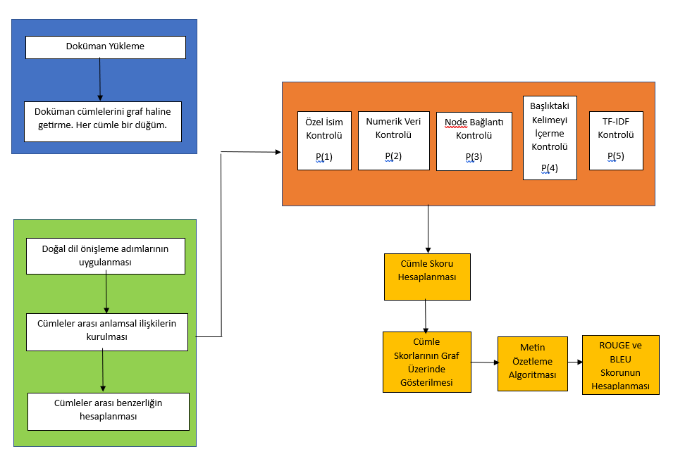

# Graph_Based_Text_Summarization
Generating a summary of the text in a selected document. Inter-sentence scores are displayed in graph structure. Finally, the blue and rouge scores are calculated.

